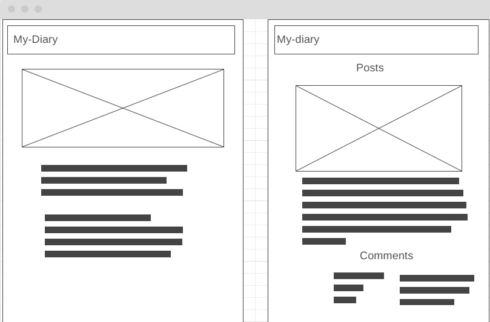
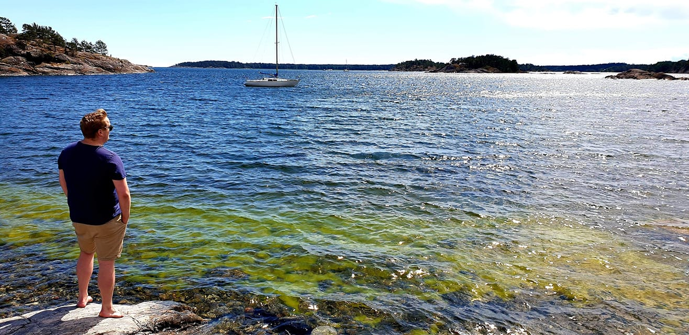
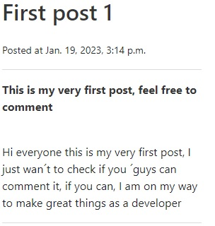
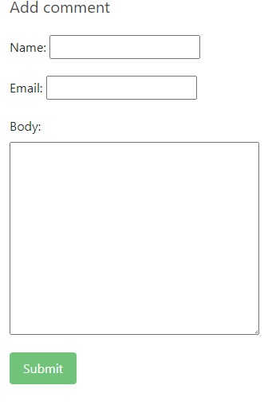
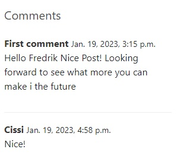
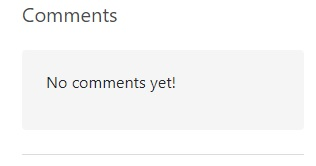
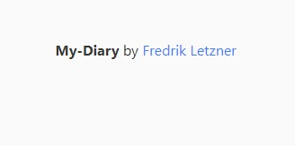
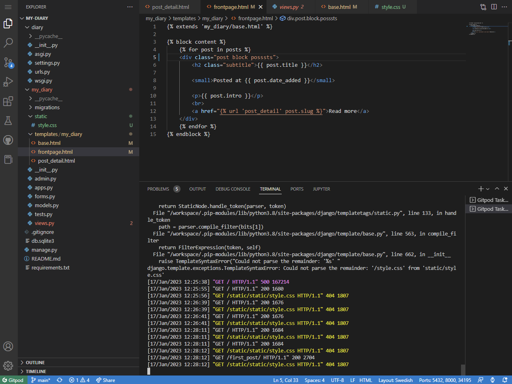
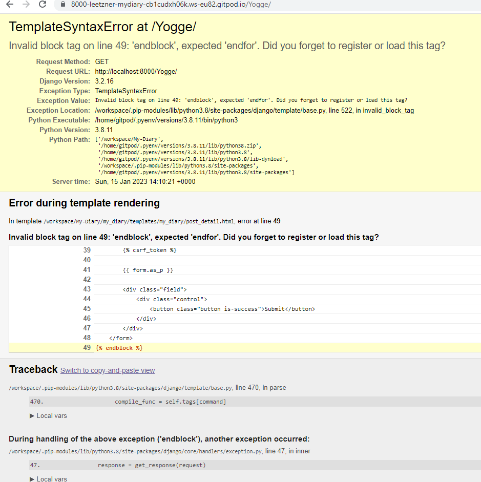

# My-Diary

 This project is made for me personaly to clear my head of thoughts thru out the day.
 As a viewer you will get the chance to comment my posts and hopefully bring joy to my posts.

 I made this very simple yet quite agile project (I really wanna make it better in useful ways but my timebank is running out for the momment being).

 This was a quite hard project to jump to, felt like the leap was far too great from the other projects I´ve done.

 This app is all about peace and reflection.

 

## Features 

"What you see is what you get"
This app has a simple layout, a simple comment field with a simple tought behind it.

The navbar will direct you to the frontpage where all the posts are, as you click on the "Read me" link you´ll get redirected to the post-detail page.
There you can comment and choose any nickname for the comment.

### Existing Features

- __Navigationbar__

    Simple navigationbar that only serves one purpose, take you back where you belong ( at the frontpage reading all my posts).

    The button  "My-Diary" has a hover over effect that Bulma supply.

- __Image__

    This is a image of me looking out over the ocean, thinking about everything else than stress and time.

- __Posts__
    
    The posts is filtered from newest to oldest, with the newest starting from the top of the page

- __Comments__

    Here you can comment, choose any name and write what you think about my post.

    To add comment

    

    

    If no one has commented before this will show.

    
- __Footer__

    Footer is provided by Bulma, the link will take you to my github page

    

### Features Left to Implement

I wanna make a filter tool so you can search for posts.

I wanna make a login page for visitors so that they can personally reach me if they want.

## Testing 

I´ve made some tests and testing to the site.

I didn´t get the Python tests to work due to no implement of the postreSQL.

Stumbled across this problem when I tried to implement the CSS static file.

Turned out that I didn´t implement it the right way at all.

Also my app crashed due to wrong tags used in the "base.html"

And my database can´t send readable summernote to HTML.

### Validator Testing 
- HTML
  - No errors were returned when passing through the official [W3C validator](https://validator.w3.org/nu/?doc=https%3A%2F%2Fmy-diary-leetzner.herokuapp.com%2F)
- CSS
  - No errors were found when passing through the official [(Jigsaw) validator](https://jigsaw.w3.org/css-validator/validator?uri=https%3A%2F%2Fmy-diary-leetzner.herokuapp.com%2F&profile=css3svg&usermedium=all&warning=1&vextwarning=&lang=sv)

### Unfixed Bugs

Summernote isn´t readable on site. 
I´ve googled this but haven´t found any solution to this for now (agile work).
The summernote is implemented in the database, in the future I wanna get it to work

## Deployment

This project use ElephantSQL, Heroku and github.

It´s hosted with Django and I followed a agile process on github, with user stories and project overview.

## Credits 

Credits to "Codewithstein" watch many of his youtube videos to help build the models and views with python.

I have many thanks to google aswell, as my whole project is googled and built with other peoples smart tips.

Bulma is included in this project (Tried something else than bootstrap to learn diffrent software)

 